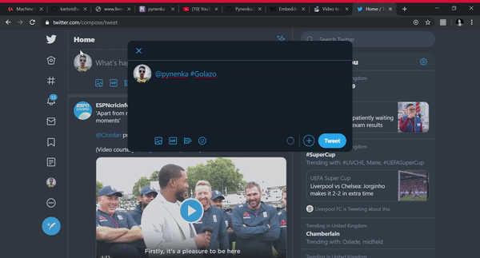

# Pynenka

Pynenka is a simple low level twitter bot that replies with the football score of the 3 nearest/current games.

The live scores are scraped from [livescores.com](https://www.livescores.com/).

The twitter app keys are removed due to security reasons.

## How does it work
To test pynenka simply open twitter and [@pynenka](https://twitter.com/pynenka) followed by the hashtag #Golazo and never miss out on any moment!
Pynenka sleeps during the day and activates in the evening so if you mention it before, you will get your reply only when its awake

### Demo

### TODO
1. Add Goalscorers and make it more responsive.
2. Like and Comment on selected #Football posts
3. Return live score of requested games
4. Follow the mentions if not already

### Update
Pynenka now also tweets the game start time/minutes played
App deployed on heroku

